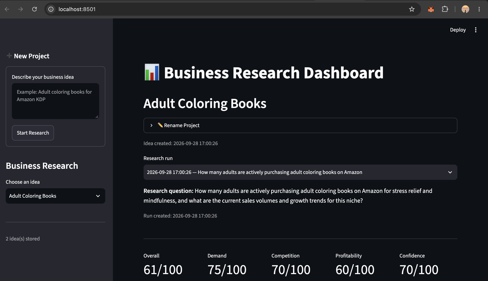

# 🚀 Business Research OS

An AI-powered business research and validation system that helps evaluate business ideas before investing time and money.

This project is built for personal use as a **Founder Operating System**.

Instead of replacing human decision-making, it helps collect evidence, analyse markets, document decisions, and improve future business choices.

---

# Features

## Research Pipeline

- Generate research questions
- Generate search queries
- Search the web (Tavily)
- AI-powered structured analysis
- SQLite persistence
- Automatic caching

---

## Dashboard

- Create projects
- Rename projects
- Browse previous research
- Radar chart
- Opportunity score
- Customer segments
- Risks
- Evidence
- Recommended next experiments

---

## Tech Stack

- Python
- LangGraph
- LangChain
- Groq
- Tavily
- SQLite
- Streamlit
- Plotly

---

# Project Structure

```
business-research-agent/

dashboard.py

graph.py

database.py

research_pipeline.py

services.py

nodes/

state.py
```

---

# Installation

Clone the repository

```bash
git clone <repo-url>
```

Create virtual environment

```bash
python -m venv .venv
```

Activate

Mac/Linux

```bash
source .venv/bin/activate
```

Windows

```bash
.venv\Scripts\activate
```

Install dependencies

```bash
pip install -r requirements.txt
```

Create `.env`

```
GROQ_API_KEY=...

TAVILY_API_KEY=...
```

Run

```bash
streamlit run dashboard.py
```

---

# Current Version

v1.0

# Business Research OS



Current workflow

```
Business Idea

↓

Research Question

↓

Search Queries

↓

Web Search

↓

AI Analysis

↓

SQLite

↓

Dashboard
```

---

# Future Roadmap

See ROADMAP.md

---

# License

MIT